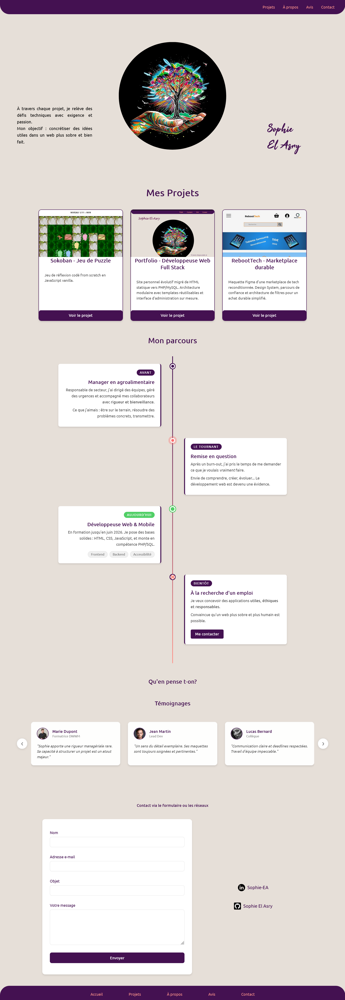
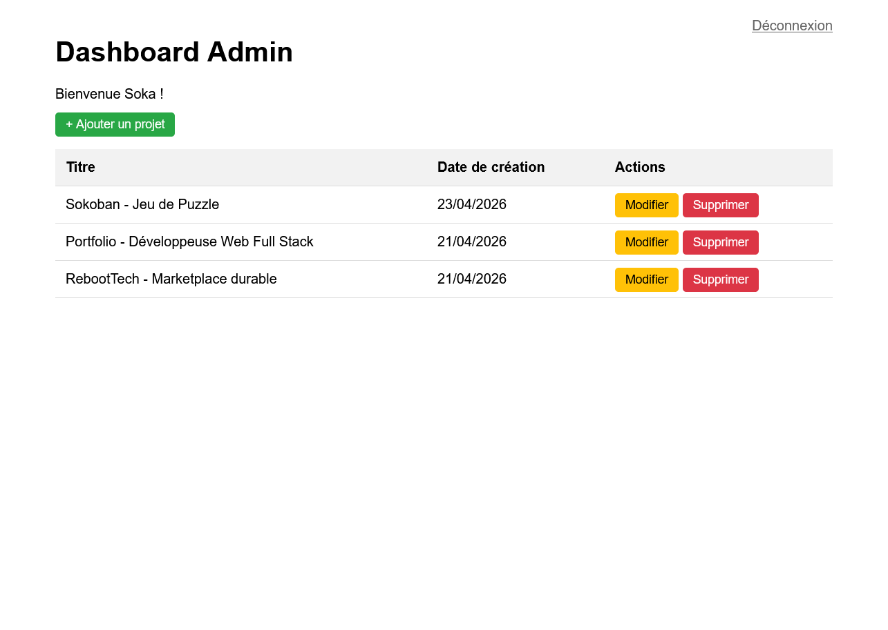

# Portfolio | Sophie EL ASRY
**Développeuse Web Back-end — PHP / MySQL**

Portfolio full-stack avec interface d'administration sécurisée, moteur de template PHP personnalisé et architecture MVC-like.

---

## 🚀 Stack technique
- **Back-end** : PHP 8, MySQL, PDO, architecture modulaire
- **Front-end** : HTML5 sémantique, CSS3, JavaScript vanilla
- **Outils** : Git, Figma, VS Code
- **Qualité** : Accessibilité, sécurité (CSRF, validation serveur), performances Lighthouse
---

## ✨ Fonctionnalités clés
- 🔐 Interface d'administration sécurisée (CRUD projets, upload d'images)
- 🗂️ Modélisation de base de données avec la méthode MERISE
- 🛡️ Sécurisation applicative : tokens CSRF, validation serveur stricte, protection des uploads, masquage de structure
- ⚡ Routage dynamique par slug et moteur de template PHP maison
- ♿ Exigences qualité web : accessibilité, scores Lighthouse optimaux

---

## 🖼️ Aperçu

---

## 👤 Auteur
**Sophie EL ASRY** — Développeuse Web & Web Mobile  
📍 Valence (26) — Disponible pour un CDI Fullstack orienté Back-end  
💼 [LinkedIn](linkedin.com/in/sophie-el-asry) | 🌐 [Portfolio en ligne](url-quand-déployé)

---
*Projet personnel réalisé dans le cadre du titre professionnel DWWM.*
